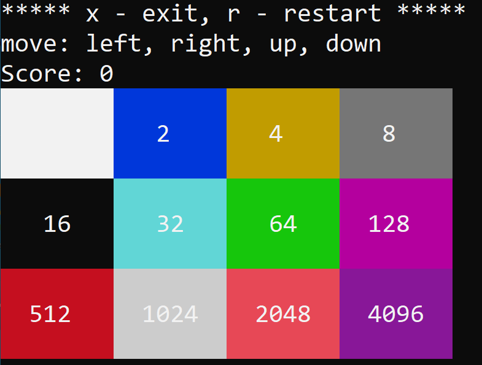

# 2048 console game: text, color and keyboard version.
***** x - exit, r - restart *****  
move: left, right, up, down  
[0, 0, 0, 0]  
[0, 0, 0, 0]  
[0, 0, 0, 0]  
[0, 2, 0, 2]  
Score: 0   
Enter move: **`right`**  
***** x - exit, r - restart *****  
move: left, right, up, down  
Score: 4  
[0, 0, 2, 0]  
[0, 0, 0, 0]  
[0, 0, 0, 0]  
[0, 0, 0, 4]   
# Color ver in console

